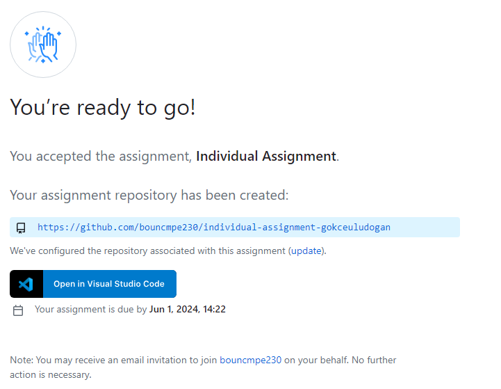

## **Accessing the Assignment through GitHub Classroom**

### **1. Open the Assignment Link**

First, click on the provided assignment link to access the GitHub Classroom assignment.Here is an example individual assignment link:

https://classroom.github.com/a/YWk-dquE

### **2. Join the GitHub Classroom**

Upon accessing the link, join the GitHub Classroom by selecting your  ID from the list shown to link your GitHub account.


### **3. Accept the Assignment**

After selecting your identifier, accept the assignment:


### **4. Refresh the Page if Necessary**

A confirmation message will appear, indicating that you have successfully accepted the assignment.


If required, refresh the page to update any changes or status.



### **5. Clone the Repository and Begin Your Work**

Finally, clone the repository to your local machine using the following command and start working on your assignment:

```bash
git clone https://github.com/bouncmpe230/individual-assignment-<username>

```