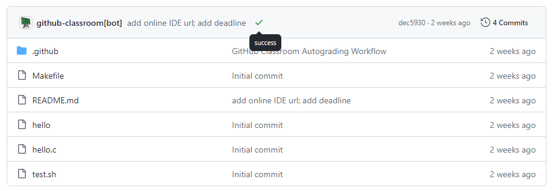
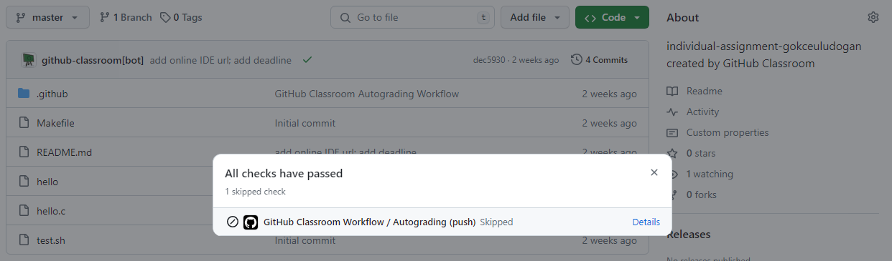

## **Accessing the Assignment through GitHub Classroom**

### **1. Open the Assignment Link**

First, click on the provided assignment link to access the GitHub Classroom assignment.Here is an example individual assignment link:

https://classroom.github.com/a/YWk-dquE

### **2. Join the GitHub Classroom**

Upon accessing the link, join the GitHub Classroom by selecting your  ID from the list shown to link your GitHub account.


### **3. Accept the Assignment**

After selecting your identifier, accept the assignment:


### **4. Refresh the Page if Necessary**

A confirmation message will appear, indicating that you have successfully accepted the assignment.


If required, refresh the page to update any changes or status.


### **5. Clone the Repository and Begin Your Work**

Finally, clone the repository to your local machine using the following command and start working on your assignment:

```bash
git clone https://github.com/bouncmpe230/individual-assignment-<username>

```
If you encounter an authentication error, follow [GitHub Authentication Guide](auth.md) to connect with ssh. 

### **6. Autograding**

After making necessary changes to the files, commit and push the updated files via terminal (using git add, commit, push commands) or VSCode's source control window. An autograding workflow will run to display the status of your last commit: `pending`, `success`, or `failure`.




- `Pending` indicates that the workshop job is currently in queue and will be executed soon.

- `Success` means that your code has passed all tests.

- `Failure` suggests that your code failed some tests.

The defined tests can be found in `autograding.json` under the `.github/classroom` directory in your repository.


To view the log associated with the autograding run, click on the status button (i.e. success, failure, pending) and then click `Details`. This will direct you to the `Actions` tab.



Next, you can check the outputs associated with the `Autograding` job.


