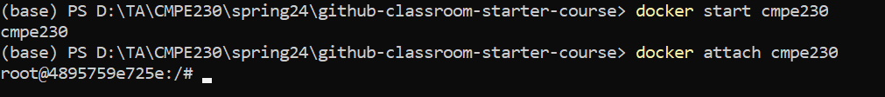
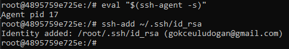
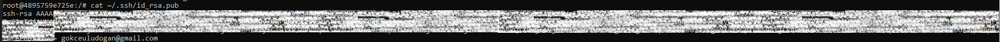
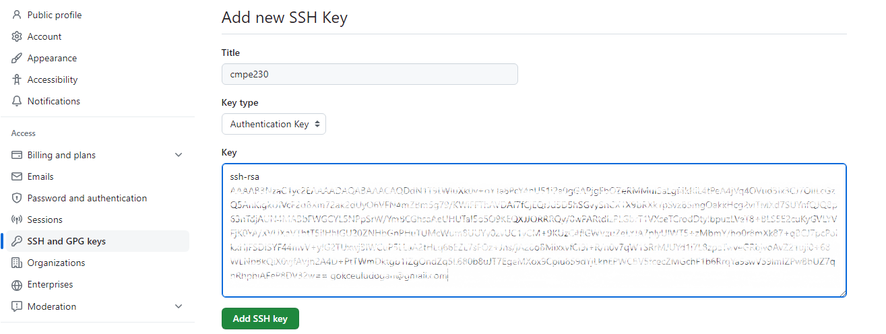

## GitHub Authentication Guide

This guide will help you to configure GitHub authentication for your Docker container.

### Connecting to Your Docker Container

To begin, establish a connection with your Docker container. Execute the following commands in your terminal:


```bash
docker start cmpe230
docker attach cmpe230
```



### Generating SSH Key

For secure authentication with GitHub, generate an SSH key using the following command. Replace `your_email@example.com` with your email:


```bash
ssh-keygen -t rsa -b 4096 -C "your_email@example.com"
```

### Adding SSH Key to SSH Agent

Next, add your newly created SSH key to the SSH agent for managing your identities:
    
```bash
eval "$(ssh-agent -s)"
ssh-add ~/.ssh/id_rsa
```



### Adding SSH Key to Your GitHub Account

To link the SSH key with your GitHub account, display your SSH public key using:


```bash
cat ~/.ssh/id_rsa.pub
```



Copy the output and navigate to your GitHub account settings. Go to `SSH and GPG keys`, click on `New SSH key`, and paste your copied key.




### Testing the SSH Connection

Finally, verify the SSH connection by attempting to clone a GitHub repository. Use this command, replacing <username> with your GitHub username:

```bash
git clone git@github.com:bouncmpe230/individual-assignment-<username>.git
```

Replace `<username>` with your GitHub username.


